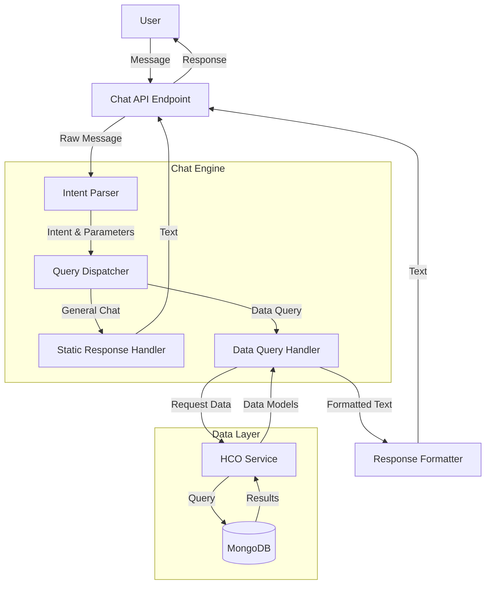

# Technical Design Document: Chat-Based Data Insights

## 1. Architecture Overview

The enhanced chat system will evolve from a simple keyword-response model to an intent-driven architecture capable of querying data. The new flow decouples intent recognition from data retrieval and response generation.



### Component Roles
- **Intent Parser**: Analyzes user input to determine if it's a general chat or a specific data query. Extracts parameters (e.g., "top 5", "ghost patients").
- **Query Dispatcher**: Routes the request to the appropriate handler based on the detected intent.
- **HCO Service**: A new intermediate layer that encapsulates database logic, refactored from the existing `hcos.py` router. This allows both the API router and Chat engine to reuse the same data access logic.
- **Response Formatter**: Converts structured data (list of HCO objects) into natural language strings.

## 2. Intent Detection Strategy

For the MVP, we will use a pragmatic regex-based approach to detect intents without introducing heavy NLP libraries.

### Supported Intents
1.  **`GENERAL_CHAT`**: Default intent for greetings, help, etc. (Existing functionality)
2.  **`TOP_HCOS_BY_METRIC`**: Specific intent for queries like "top 5 HCOs with highest ghost patients".

### Pattern Matching Logic
The system will check against regex patterns in priority order.

**Pattern for `TOP_HCOS_BY_METRIC`:**
```python
# Regex to capture limit (optional, default 5) and metric context
r"top\s+(\d+)?\s*hcos?.*(?:ghost|patients?)"
```
*Matches:*
- "Show me the top 5 HCOs with highest ghost patients" -> `limit=5`
- "top 10 hcos ghost patients" -> `limit=10`
- "top hcos by ghost patients" -> `limit=5` (default)

**Fallback:**
If no data query pattern matches, default to `GENERAL_CHAT`.

## 3. Data Access Pattern

Currently, data access logic resides tightly coupled within `backend/routers/hcos.py`. To support the chat feature without duplicating code, we will refactor the database logic into a reusable Service Layer.

### Proposed Refactoring
1.  **Create `backend/services/hco_service.py`**.
2.  **Extract Logic**: Move the MongoDB query building and aggregation logic from `routers/hcos.py` -> `get_hcos` into `HCOService.get_hcos(...)`.
3.  **Update Router**: The API router will now call `HCOService.get_hcos` instead of querying the DB directly.
4.  **Chat Integration**: The Chat Query Handler will also call `HCOService.get_hcos`.

**Service Method Signature:**
```python
async def get_hcos(
    db: Database,
    limit: int = 100,
    sort_by: str = "ghost_patients",
    # ... other filters
) -> List[dict]:
    # ... existing logic from routers/hcos.py ...
```

## 4. Query Handler Design

We will implement a handler pattern to manage different types of data queries.

### Handler Structure
```python
class QueryHandler:
    async def handle(self, params: dict) -> str:
        raise NotImplementedError

class TopHCOsHandler(QueryHandler):
    def __init__(self, db):
        self.db = db
        
    async def handle(self, params: dict) -> str:
        limit = params.get('limit', 5)
        metric = params.get('metric', 'ghost_patients')
        
        # Call Service
        results = await hco_service.get_hcos(
            self.db, 
            limit=limit, 
            sort_by=metric
        )
        
        # Format Response
        return self._format_response(results, metric)

    def _format_response(self, hcos: List[dict], metric: str) -> str:
        # Implementation in Section 5
```

## 5. Response Formatting

The chat needs to return friendly text, not JSON. The formatter will take the data models and generate a markdown-formatted list.

**Template Strategy:**
For "Top HCOs", the output will be:
1.  **Header**: "Here are the top {N} HCOs by {metric}:"
2.  **List Items**: "{Rank}. **{Name}** ({State}) - {Value} {Metric Name}"

**Example Output:**
> Here are the top 5 HCOs with the highest ghost patients:
> 
> 1. **California Medical Center** (CA) - 87 ghost patients
> 2. **Texas Health System** (TX) - 65 ghost patients
> ...

**Code Snippet Logic:**
```python
lines = [f"Here are the top {len(hcos)} HCOs by ghost patients:"]
for i, hco in enumerate(hcos, 1):
    lines.append(f"{i}. **{hco['name']}** ({hco['state']}) - {hco['ghost_patients']} ghost patients")
return "\n\n".join(lines)
```

## 6. API Contract

The external API contract remains largely compatible with the existing endpoint, but the internal processing changes.

**Endpoint:** `POST /api/v1/chat/message`

**Request (`ChatMessageRequest`):**
```json
{
  "message": "Show me the top 5 HCOs with highest ghost patients",
  "session_id": "optional-uuid"
}
```

**Response (`ChatMessageResponse`):**
```json
{
  "response": "Here are the top 5 HCOs by ghost patients:\n\n1. **California Medical Center** (CA) - 87 ghost patients...",
  "session_id": "uuid",
  "timestamp": "2023-10-27T10:00:00Z"
}
```

## 7. Extensibility Plan

To add new query types (e.g., "Find HCOs in California") in the future:

1.  **Add Pattern**: Add a new regex to the `IntentParser` configuration.
2.  **Create Handler**: Implement a new `QueryHandler` subclass (e.g., `RegionSearchHandler`).
3.  **Register**: Map the new intent to the new handler in the `QueryDispatcher`.
4.  **Update Service**: Ensure `HCOService` supports the necessary filters (already supported for state/region).

This design ensures that adding new capabilities requires strictly additive changes, minimizing regression risks for existing features.