# Precision Commercial Engagement System - Flowcharts

## 1. High-Level System Architecture

```mermaid
flowchart TB
    subgraph External["External Data Sources"]
        CRM[("CRM System<br/>(Veeva/Salesforce)")]
        Claims[("Claims Data<br/>(IQVIA/Symphony)")]
        Form[("Formulary Data<br/>(MMI/MMIT)")]
    end
    
    subgraph Ingestion["Agent 1: Data Ingestion"]
        ETL["ETL Pipeline"]
        Valid["Data Validation"]
        MDM["Master Data<br/>Management"]
        Trigger["Trigger<br/>Detection"]
    end
    
    subgraph Scoring["Agent 2: HCP Scoring"]
        Prop["Propensity<br/>Models"]
        NBA["NBA<br/>Generation"]
        Prior["Priority<br/>Scoring"]
    end
    
    subgraph Activation["Agent 3: Activation"]
        Chan["Channel<br/>Selection"]
        Field["Field Rep<br/>CRM Push"]
        Email["Email<br/>Campaign"]
        Digital["Digital<br/>Ads"]
    end
    
    subgraph Learning["Agent 4: Learning (RLHF)"]
        Feed["Feedback<br/>Collection"]
        Reward["Reward<br/>Calculation"]
        Retrain["Model<br/>Retraining"]
    end
    
    subgraph Database[("Central Database")]
        HCP[("HCP<br/>Profiles")]
        NBAdb[("NBAs")]
        Scores[("Scores")]
        Feedback[("Feedback")]
    end
    
    CRM -->|HCP Data| ETL
    Claims -->|Rx Data| ETL
    Form -->|Formulary| ETL
    
    ETL --> Valid
    Valid --> MDM
    MDM --> Trigger
    
    Trigger -->|Trigger Events| Prop
    Database --> Prop
    
    Prop --> NBA
    NBA --> Prior
    Prior --> NBAdb
    
    NBAdb --> Chan
    Chan --> Field
    Chan --> Email
    Chan --> Digital
    
    Field -->|Feedback| Feed
    Email -->|Engagement| Feed
    Digital -->|Clicks| Feed
    
    Feed --> Reward
    Reward --> Retrain
    Retrain -->|Updated Models| Prop
    
    style External fill:#e1f5ff
    style Ingestion fill:#fff4e1
    style Scoring fill:#ffe1f5
    style Activation fill:#e1ffe1
    style Learning fill:#f5e1ff
    style Database fill:#ffe1e1
```

## 2. Detailed Workflow - End-to-End Process


## 3. Real-Time Competitive Response Flow

```mermaid
flowchart LR
    subgraph Time["Timeline: <1 Hour"]
        T0["T+0 min<br/>Competitor Rx<br/>Filled"]
        T15["T+15 min<br/>Claim<br/>Received"]
        T16["T+16 min<br/>Trigger<br/>Detected"]
        T17["T+17 min<br/>NBA<br/>Generated"]
        T18["T+18 min<br/>CRM Alert<br/>Sent"]
        T60["T+60 min<br/>Rep<br/>Notified"]
    end
    
    T0 --> Pharmacy[("Pharmacy<br/>System")]
    Pharmacy --> Clearinghouse[("Claims<br/>Clearinghouse")]
    Clearinghouse --> T15
    
    T15 --> System["Precision<br/>Engine"]
    System --> T16
    
    T16 --> Analyze["Analyze:<br/>• HCP History<br/>• Formulary<br/>• Patient Data"]
    Analyze --> T17
    
    T17 --> Create["Create NBA:<br/>Priority: 75/100<br/>Channel: Field<br/>Timing: 24hrs"]
    Create --> T18
    
    T18 --> Push["Push to<br/>Veeva CRM"]
    Push --> T60
    
    T60 --> Rep["Field Rep<br/>Mobile Alert"]
    Rep --> Action["Rep Contacts<br/>HCP Next Day"]
    
    style T0 fill:#ff9999
    style T18 fill:#99ff99
    style Action fill:#9999ff
```



## 4. RLHF Learning Loop Detail

```mermaid
flowchart TD
    subgraph RepInterface["Rep Interface"]
        ViewNBA[Rep Views<br/>NBA in CRM]
        TakeAction[Rep Takes<br/>Action]
        ProvideFeed[Rep Provides<br/>Feedback]
    end
    
    subgraph FeedbackTypes["Feedback Types"]
        Binary["👍👎<br/>Binary"]
        Rating["⭐⭐⭐⭐⭐<br/>1-5 Stars"]
        Text["💬<br/>Text Comment"]
        Voice["🎤<br/>Voice Note"]
    end
    
    subgraph Processing["Learning Agent Processing"]
        Extract[Extract<br/>Sentiment]
        CalcSent{Sentiment<br/>Score}
        CalcReward[Calculate<br/>Reward Signal]
    end
    
    subgraph ModelUpdate["Model Update"]
        RewardFunc[Reward Function:<br/>r = sentiment × priority × trigger_weight]
        UpdateWeights[Update Neural<br/>Network Weights]
        LogPerf[Log Performance<br/>Metrics]
    end
    
    subgraph Improvement["Continuous Improvement"]
        Patterns[Analyze<br/>Patterns]
        Recommend[Generate<br/>Recommendations]
        ABTest[A/B Test<br/>Changes]
        Deploy[Deploy<br/>Improved Model]
    end
    
    ViewNBA --> TakeAction
    TakeAction --> ProvideFeed
    
    ProvideFeed --> Binary
    ProvideFeed --> Rating
    ProvideFeed --> Text
    ProvideFeed --> Voice
    
    Binary -->|1.0 or 0.0| Extract
    Rating -->|Normalize| Extract
    Text -->|NLP| Extract
    Voice -->|Transcribe+NLP| Extract
    
    Extract --> CalcSent
    CalcSent -->|Positive >0.6| PosReward["+0.5 to +1.0"]
    CalcSent -->|Neutral 0.4-0.6| NeutReward["0.0"]
    CalcSent -->|Negative <0.4| NegReward["-1.0 to -0.5"]
    
    PosReward --> CalcReward
    NeutReward --> CalcReward
    NegReward --> CalcReward
    
    CalcReward --> RewardFunc
    RewardFunc --> UpdateWeights
    UpdateWeights --> LogPerf
    
    LogPerf --> Patterns
    Patterns --> Recommend
    Recommend --> ABTest
    ABTest --> Deploy
    
    Deploy -.->|Better NBAs| ViewNBA
    
    style ProvideFeed fill:#FFD93D
    style UpdateWeights fill:#6BCB77
    style Deploy fill:#4D96FF
```



## 5. Propensity Scoring Algorithm


## 6. Production Deployment Flow

```mermaid
flowchart TD
    subgraph Phase1["Phase 1: Foundation (4 weeks)"]
        P1W1[Week 1-2:<br/>Infrastructure]
        P1W2[Week 3-4:<br/>Data Integration]
    end
    
    subgraph Phase2["Phase 2: Development (6 weeks)"]
        P2W1[Week 5-6:<br/>ML Models]
        P2W2[Week 7-8:<br/>CRM Integration]
        P2W3[Week 9-10:<br/>Security Audit]
    end
    
    subgraph Phase3["Phase 3: Pilot (4 weeks)"]
        P3W1[Week 11-12:<br/>Limited Pilot<br/>50-100 Reps]
        P3W2[Week 13-14:<br/>Refinement]
    end
    
    subgraph Phase4["Phase 4: Rollout (6 weeks)"]
        P4W1[Week 15-16:<br/>25% Rollout]
        P4W2[Week 17-18:<br/>75% Rollout]
        P4W3[Week 19-20:<br/>100% + Optimize]
    end
    
    Start([Project<br/>Kickoff]) --> P1W1
    P1W1 --> P1W2
    P1W2 --> Gate1{Go/No-Go<br/>Gate 1}
    
    Gate1 -->|Go| P2W1
    Gate1 -->|No-Go| Fix1[Fix Issues]
    Fix1 --> P1W2
    
    P2W1 --> P2W2
    P2W2 --> P2W3
    P2W3 --> Gate2{Go/No-Go<br/>Gate 2}
    
    Gate2 -->|Go| P3W1
    Gate2 -->|No-Go| Fix2[Fix Issues]
    Fix2 --> P2W3
    
    P3W1 --> Measure1[Measure:<br/>• System Performance<br/>• User Adoption<br/>• Data Quality]
    Measure1 --> P3W2
    P3W2 --> Gate3{Success<br/>Criteria Met?}
    
    Gate3 -->|Yes| P4W1
    Gate3 -->|No| Adjust[Adjust &<br/>Retry Pilot]
    Adjust --> P3W1
    
    P4W1 --> Monitor1[Monitor<br/>Metrics]
    Monitor1 --> P4W2
    P4W2 --> Monitor2[Monitor<br/>Metrics]
    Monitor2 --> P4W3
    
    P4W3 --> Final([Production<br/>Complete])
    
    Final --> Ongoing[Ongoing:<br/>• Model Retraining<br/>• Feature Updates<br/>• Scale Optimization]
    
    style Start fill:#90EE90
    style Final fill:#FFD93D
    style Gate1 fill:#FF6B6B
    style Gate2 fill:#FF6B6B
    style Gate3 fill:#FF6B6B
```



---

## How to View These Flowcharts

**Option 1: Markdown Viewer with Mermaid Support**
- GitHub (renders automatically)
- VS Code with Mermaid extension
- Obsidian
- Notion

**Option 2: Online Mermaid Editor**
1. Go to: https://mermaid.live/
2. Copy any diagram code above
3. Paste and view/edit

**Option 3: Export to Image**
- Use mermaid.live to export as PNG/SVG
- Include in presentations

---

## Flowchart Summary

1. **High-Level Architecture** - Shows all 4 agents and data flow
2. **Detailed Workflow** - Complete end-to-end process from claim to feedback
3. **Real-Time Response** - Timeline showing <1 hour competitive response
4. **RLHF Learning Loop** - How the system learns and improves
5. **Propensity Scoring** - Algorithm breakdown with score calculation
6. **Production Deployment** - 20-week rollout plan with gates

Each diagram can be viewed, edited, and exported independently!
