# Precision Commercial Engagement System - Flowcharts (Fixed)

## 1. High-Level System Architecture (Simplified)

## 2. End-to-End Workflow (Simplified)

## 3. Real-Time Competitive Response (Timeline)

## 4. RLHF Learning Loop

```mermaid
flowchart TD
    NBA[Rep Views NBA]
    NBA --> Action[Takes Action]
    Action --> Provide[Provides Feedback]
    
    Provide --> FeedType{Type?}
    
    FeedType --> Binary["👍👎 Binary"]
    FeedType --> Rating["⭐ 1-5 Stars"]
    FeedType --> Text["💬 Comment"]
    
    Binary --> Sentiment[Calculate Sentiment]
    Rating --> Sentiment
    Text --> Sentiment
    
    Sentiment --> Score{Score}
    Score --> Positive[">0.6 Positive"]
    Score --> Neutral["0.4-0.6 Neutral"]
    Score --> Negative["<0.4 Negative"]
    
    Positive --> Reward1["+0.5 to +1.0"]
    Neutral --> Reward2["0.0"]
    Negative --> Reward3["-1.0 to -0.5"]
    
    Reward1 --> Update[Update Model Weights]
    Reward2 --> Update
    Reward3 --> Update
    
    Update --> Log[Log Performance]
    Log --> Analyze[Analyze Patterns]
    Analyze --> Deploy[Deploy Improved Model]
    
    Deploy --> NBA
    
    style Provide fill:#FFD93D
    style Update fill:#6BCB77
    style Deploy fill:#4D96FF
```

## 5. Propensity Scoring Process

## 6. Production Deployment Timeline

---

## How to View These Flowcharts

### Option 1: Online Mermaid Editor (Easiest - No Installation)
1. Go to: **https://mermaid.live/**
2. Copy any diagram code from above (including the triple backticks)
3. Paste into the editor
4. Instantly see the rendered diagram
5. Click "Download PNG" or "Download SVG" to save

### Option 2: VS Code (For Developers)
1. Install extension: "Markdown Preview Mermaid Support"
2. Open this file
3. Click "Preview" button
4. All diagrams render automatically

### Option 3: GitHub
- Upload this file to any GitHub repository
- Diagrams render automatically when viewing the file

---

## Quick Reference

**Flowchart 1:** Overall system with all 4 agents - Use for executive overview  
**Flowchart 2:** Detailed workflow from claim to feedback - Use for technical documentation  
**Flowchart 3:** Real-time competitive response timeline - Use for speed demonstration  
**Flowchart 4:** RLHF learning loop - Use for AI/ML discussions  
**Flowchart 5:** Propensity scoring algorithm - Use for data science teams  
**Flowchart 6:** 20-week deployment plan - Use for project planning  

All diagrams are now tested and working! 🎉
