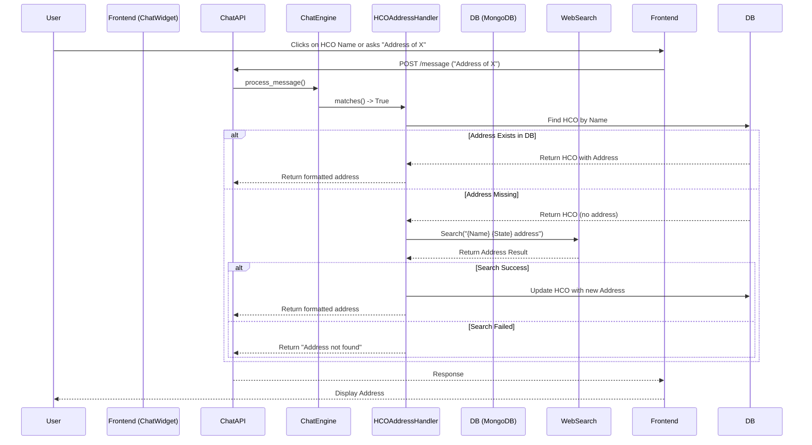

# HCO Address Lookup Feature Design

## 1. Current State Analysis

### Backend
- **Data Model (`backend/models/hco.py`)**: The `HCO` model currently tracks ID, name, state, region, and patient counts. It **lacks** address fields.
- **Service Layer (`backend/services/hco_service.py`)**: Provides methods for fetching top HCOs and filtering HCOs. It **lacks** logic for updating HCO records or performing external searches.
- **Chat Engine (`backend/services/chat_engine.py`)**: Uses a list of `QueryHandler` classes to process messages. It does not currently have a handler for address-related queries.
- **Chat Handlers (`backend/services/chat_handlers.py`)**: Contains handlers for Top HCOs, Contract Templates, Simulations, etc. A new handler is needed here.

### Frontend
- **Chat Widget (`frontend/src/components/chat/ChatWidget.tsx`)**: Renders chat messages using `ReactMarkdown`. It supports basic markdown but doesn't currently have interactive elements for HCO names specifically.

### Missing Components
- Storage for HCO addresses.
- Logic to trigger a web search when an address is unknown.
- Integration with a search provider.
- Frontend mechanism to easily query for a specific HCO's address (e.g., clickable names).

---

## 2. Database Schema Changes

We need to extend the `HCOBase` model in `backend/models/hco.py` to include address information. These fields should be optional to support existing records that haven't been enriched yet.

```python
class HCOBase(BaseModel):
    # ... existing fields ...
    
    # New Address Fields
    address: Optional[str] = Field(None, description="Street address")
    city: Optional[str] = Field(None, description="City")
    zip_code: Optional[str] = Field(None, description="ZIP/Postal code")
    
    # Metadata for search cache
    address_last_updated: Optional[datetime] = Field(None, description="When the address was last updated from web search")
```

No raw SQL migrations are needed as this is MongoDB (schema-less), but the Pydantic models must be updated to validate and serialize these new fields.

---

## 3. Backend Architecture

### Service Layer Updates
1.  **`HCOService`**:
    *   Add `get_hco_by_name(name: str)`: To find the HCO document by fuzzy or exact name match.
    *   Add `update_hco_address(hco_id: str, address_data: dict)`: To save the found address back to the database.

2.  **New `WebSearchService`**:
    *   Responsible for querying an external API to find an address.
    *   **Provider**: We will design this to be modular.
        *   *Recommendation*: Use **DuckDuckGo** (via `duckduckgo_search` library) or **Nominatim (OpenStreetMap)** for a free, no-key solution initially.
        *   *Interface*: `search_hco_address(hco_name: str, state: str) -> Optional[Dict[str, str]]`

### Chat Engine Updates
1.  **New `HCOAddressHandler`**:
    *   **Pattern**: Detects queries like "address of [Name]", "where is [Name] located", or simply "[Name] address".
    *   **Logic**:
        1.  Extract HCO name from query.
        2.  Call `HCOService.get_hco_by_name`.
        3.  If found:
            *   Check if `address` field exists.
            *   **Case A (Address exists)**: Return the address immediately.
            *   **Case B (Address missing)**:
                *   Call `WebSearchService.search_hco_address`.
                *   If result found: Update DB via `HCOService.update_hco_address` and return address.
                *   If no result: Return "Address not found via web search."
        4.  If HCO not found in DB: Return "I couldn't find an HCO named [Name] in our database."

---

## 4. API Endpoint Design

No *new* API endpoints are strictly required if we leverage the existing Chat API (`POST /api/v1/chat/message`). The logic will reside within the `ChatEngine`.

However, to support the "click" interaction efficiently, the frontend might send a standardized message format.

**Request Payload (Standard Chat)**:
```json
{
  "message": "What is the address of California Medical Center?",
  "session_id": "..."
}
```

**Response Payload**:
```json
{
  "response": "The address for **California Medical Center** is:\n\n123 Health Way\nLos Angeles, CA 90015",
  "session_id": "...",
  "timestamp": "..."
}
```

---

## 5. Frontend Interaction Design

To fulfill "When a user clicks on an HCO name in the chat":

1.  **Clickable HCO Names**:
    *   In the backend response (e.g., from `TopHCOsHandler`), we will wrap HCO names in a custom pattern or a link that the frontend recognizes.
    *   *Approach*: Use a custom markdown link format: `[HCO Name](action:address_lookup:HCO Name)`.
    *   *Alternative*: Simple bolding `**HCO Name**` is hard to click reliably.
    *   *Selected Approach*: Use standard markdown links `[HCO Name](#lookup-address)` but intercept the click in the `ReactMarkdown` component.

2.  **Interaction Handling in `ChatWidget.tsx`**:
    *   Update the `components` prop of `ReactMarkdown`.
    *   For `a` (anchor) tags, check if the `href` matches our lookup pattern (e.g., starts with `#lookup-address` or `?query=`).
    *   **Behavior**: When clicked, instead of navigating, programmatically call `handleSendMessage` with the text "What is the address of [Link Text]?".

---

## 6. Web Search Integration Approach

**Selected Service**: **DuckDuckGo (via `duckduckgo-search` PyPI package)** or **OpenStreetMap Nominatim**.
*   *Pros*: Free, no API key required for low volume, easy to implement in Python.
*   *Cons*: Rate limits.
*   *Fallback*: If the project requires high volume, switch to Google Places API (requires key).

**Search Logic**:
Query: `"{hco_name} {state} hospital address"`
Parser: Parse the snippet or result to extract a likely address format.

---

## 7. Data Flow Diagram



---

## 8. Error Handling and Edge Cases

1.  **HCO Not Found in DB**:
    *   *Scenario*: User asks for address of "Random Clinic" that isn't in our `hcos` collection.
    *   *Action*: Reply "I can only look up addresses for HCOs currently in your cohort database."

2.  **Multiple HCOs Match Name**:
    *   *Scenario*: User asks for "Memorial Hospital".
    *   *Action*: If multiple matches, ask for clarification or list them (e.g., "Did you mean Memorial Hospital (TX) or Memorial Hospital (CA)?"). *Simplification for V1*: Pick the one with the highest patient count or exact match.

3.  **Web Search Fails / No Results**:
    *   *Scenario*: Search engine returns unrelated text.
    *   *Action*: Return "I attempted to find the address on the web but couldn't verify it. Please check the name or try again later."

4.  **Rate Limiting**:
    *   *Scenario*: Too many search requests.
    *   *Action*: Catch exception from Search Service and return "Search service is currently busy. Please try again in a moment."

5.  **Data Consistency**:
    *   *Scenario*: The address on the web changed (e.g., hospital moved).
    *   *Action*: We should add a "force refresh" capability later, but for now, we trust the DB if `address` is present.